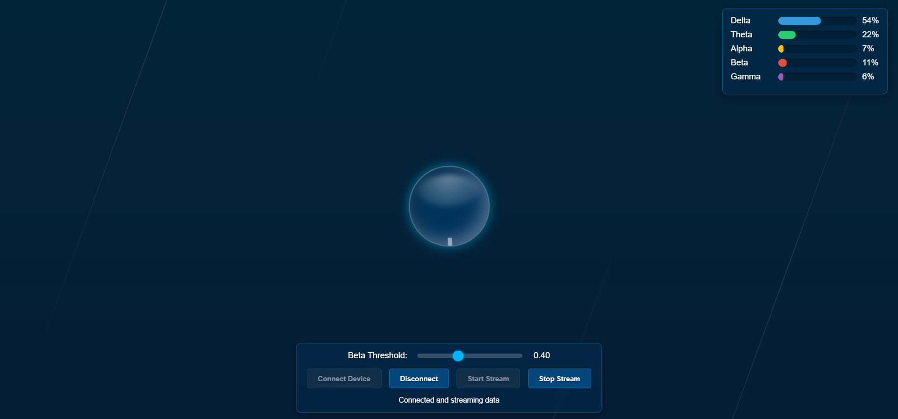

# Focion

Focion is an interactive web-based visualization game that uses EEG data to create dynamic bubble animations. The project leverages the Web Bluetooth API to connect to Neuro PlayGround Lite, which is a Bluetooth Low Energy (BLE) enabled EEG device, and processes the brainwave signals (Delta, Theta, Alpha, Beta, Gamma) to trigger animations and display real-time data.

## Features

- **EEG Data Processing:** Utilizes Fast Fourier Transform (FFT) to compute the power of different EEG frequency bands.
- **Dynamic Visualization:** Animates a balloon and generates bubbles when beta power exceeds a user-defined threshold.
- **User Controls:** Provides a control panel with buttons to connect/disconnect the device, start/stop data streaming, and adjust the beta threshold.
- **Real-Time Updates:** Displays EEG band power values with a bar graph and updates the visual effects accordingly.
- **Web Bluetooth API:** Seamlessly connects to compatible EEG devices (e.g., "NPG Lite").

## Project Structure

- **index.html:** The main HTML file that includes all the HTML, CSS, and JavaScript needed to run the application.
- **README.md:** This documentation file.

## Setup and Installation

1. **Prerequisites:**
   - A modern web browser (Chrome or Edge) with Web Bluetooth API support.
   - Neuro PlayGround Lite running [NPG-LITE-BLE](https://github.com/upsidedownlabs/Chords-Arduino-Firmware/blob/main/NPG-LITE-BLE/NPG-LITE-BLE.ino) chords firmware.

2. **Usage:**
   - Click the **Connect Device** button to search for and connect to your Neuro PlayGround Lite.
   - Once connected, click **Start Stream** to begin receiving and processing EEG data.
   - Adjust the **Beta Threshold** slider to set the sensitivity for triggering the bubble animations.
   - To disconnect, click the **Disconnect** button.

## How It Works

- **EEG Data Acquisition:** The application connects to the Neuro PlayGround Lite using BLE and starts streaming data.
- **Signal Processing:** The EEG signals are normalized, filtered, and passed through an FFT processor to calculate the power across different frequency bands.
- **Visualization:** Based on the processed EEG data, the application updates the on-screen bar graphs and animates the balloon. When the beta band power exceeds the set threshold, bubble animations are generated.
- **Control Panel:** Users can manage the connection and data streaming through a simple and intuitive control panel.

## Customization

- **Styling:** The CSS within the HTML file controls the look and feel of the application, including background gradients, animations, and user interface elements.
- **Threshold Adjustment:** The beta threshold slider can be tuned to adjust when the focus bubbles are triggered.

## Troubleshooting

- **Web Bluetooth Support:** If you encounter issues with device connectivity, ensure that your browser supports the Web Bluetooth API.
- **EEG Device Compatibility:** Confirm that your Neuro PlayGround Lite advertises the expected name prefix (e.g., "NPG") and services.

## License

This project is open-source with a GPL-3.0 license. You're welcome to modify and use it as needed. kindly remember to read the licence terms & conditions and give appropriate credit.

If you have any questions or would like to contribute, feel free to reach out or open an issue.

## Author

Created by Ritika Mishra.

